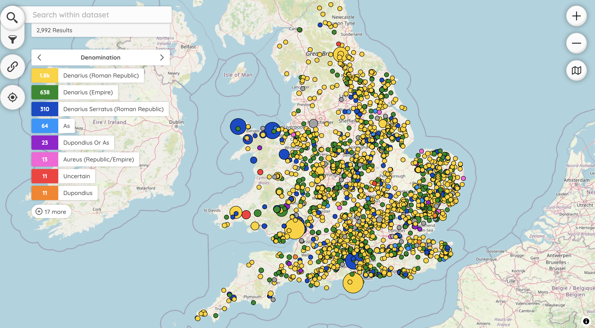
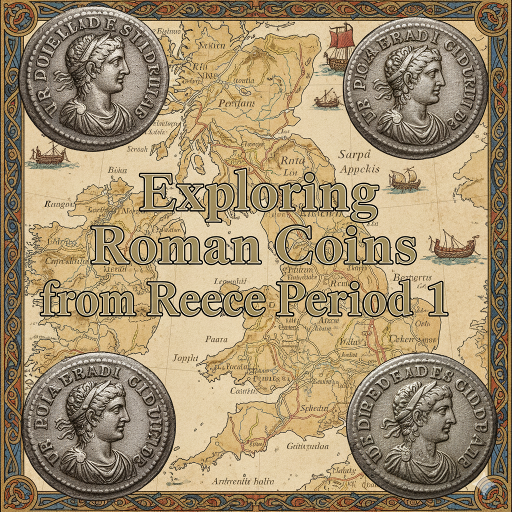

# Roman Republican Coins from the Portable Antiquities Scheme



> This work is dedicated to Sam Moorhead, who inspired so many with Roman numismatics, notes on the back of pieces of paper and bored us all with Reece Periods at every coin conference, PAS meeting and canteen lunch. He got his way, they are in Nomisma, PAS and beyond.

This repository holds data and scripts for working with Roman coins from Reece Period 1 on the [Portable Antiquities Scheme](https://finds.org.uk/database) and 
mapping them onto an instance of Peripleo. I have created all of this for the [2025 European Coin Find Network XII Annual Meeting](https://fundmuenzen.org/2025/08/22/ecfn-2025-final-programme/) being held at my former place of study, UCL Institute of Archaeology, where I'm giving a talk called 'Peripleo and PAS Republican coins: powered by an army of elves since 2003'. 

The Portable Antiquities Scheme (PAS) is a project in England and Wales to encourage the reporting of archaeological finds by the public. I built the database from 2006 - 2016, and my code is still in use now in 2025. There are plans to replace what I built, but for now, it continues to serve its purpose. This demonstration shows how linked open data drawn from the database can be used to produce interesting visualizations and insights. The presentation title refers to how the database has been nationally available since 2003, and the elves refers to a header that has been returned on every request since then ```x-powered-by: Dan's magic army of elves```. More background data on the database can be found in my publications, for example _[The Portable Antiquities Scheme's Database: its development for research since 1998](https://museologi.st/papers/portable-antiquities-development/)_.

## Stumbling blocks

The process to do this has been made considerably harder than when I was in post and I no longer have access to the same resources I did then. The British Museum IT team have removed lots of features making it harder to access data, assign recorders and finders and produce any insight into who recorded what, when or how their knowledge grew. They have also blocked search indexing and are using Cloudflare to try and prevent robots and programmatic access to data - or at least that is what they probably think. 

## Obtaining data to play with

I wanted images and data from the system and geographical context, so I wrote a series of scripts to extract and process the information I needed. These are all in Python and do the following:

- Scrape and download JSON data from the PAS website (csv download now restrictive)
- Geocode known as places to allows them to be mapped (badly)
- Download images of the coins
- Compress the images to a smaller size for use in Peripleo
- Create Linked Pasts geojson for use in Peripleo
- Split the images into obverse and reverse
- Create a ML model for coin identification
- Provide an example of running the scripts

## AI generated social preview card

This social preview card with nonsense coins on was generated with Google Gemini using this prompt:

> Create me a social preview card with a map of England with Roman Republican coins imposed on it, with the text 'Exploring Roman coins from Reece Period 1'




## Installation for Python scripts

To run the python code I recommend using a virtual environment and then run the code snippets in the appropriate sections. The libraries you will need include: OpenCV, tensorflow, Numpy, Pandas and a few others. 

```bash
git clone https://github.com/portableant/republican-coins.git
cd republican-coins
python3 -m venv venv
source venv/bin/activate
pip3 install -r requirements.txt
```

## Scrape JSON to CSV

**To get round Cloudflare, I use the `cloudscraper` library.** 

To scrape the JSON data from the PAS website and convert it to CSV format, run the following commands. This takes the JSON search results and pages through the API, without being blocked by the Cloudflare javascript challenge. When I designed the PAS database, it was meant to be interoperable, machine readable and open to all. There's now no indexed finds recoreds on Google for instance!

```python
cd scrapers
python records.py
```

## Download images

To download images of the coins, run the following command, some will fail as they are either missing or inaccessible (how that happened...) 
Some can be got from wikicommons if you fancy some manual searching. They have done a mighty job saving images on there - but are now [encountering the cloudflare issue](https://commons.wikimedia.org/wiki/Commons:Batch_uploading/Portable_Antiquities_Scheme).

```python
python images.py
```
## Compress images 

To compress downloaded images assume you are in the scrapers folder, change directory and use the following script. Compressing keeps the size down so you actually run your peripleo instance off GH pages build. I don't trust the PAS images to remain accessible easily, so they are used under CC-BY license here (I changed the BM stance on using this in 2006). If you don't compress the images, you'll get a 5GB or so repo and the pages mechanism will shout at you and say no. 

```python
cd ../scripts
python compress.py
```

## To geocode the csv for missing grids

The way the PAS was set up, we hid grid references for some finds at the request of the finder or landowner and used a field called 'known as'. This usually gives a geographical hint you can use for georeferencing using an API like Nominatim. 

```python
python geocode.py
```

## Generate LinkedPasts geojson

To generate [LinkedPasts geojson](https://github.com/LinkedPasts/linked-places-format) for use within the Peripleo instance we want to run, you can run the following command. This takes the geocoded csv file and manipulates it to meet the required structure - indexing, features with the correct structure including properties, links, depictions and types.

```python
python createLPgeoJson.py
``` 
This dataset is well structured and I didn't need to go off and find additional data. The IDs for linked open data already exist - this is a product of LAWDI and NOMISMA - and we have access to pleiadesID, dbPediaID, Wikidata, VIAF and Nomisma IDs (and WOEID and OS IDs, but hey, they went...) Time period is linked to a Periodo identifier. 

All the work for linked data and RDF was done in around 2010-2013 and is discussed in these papers:
* [Linking Portable Antiquities to a wider web](https://museologi.st/papers/linking-portable-antiquities-to-a-wider-web/)
* [Portable Antiquities on the Web](https://museologi.st/papers/portable-antiquities-on-the-web/)
* [Semantic Web Technologies Applied to Numismatic Collections](https://museologi.st/papers/semantic-web-technologies-applied-to-numismatic-collections/)

So one feature will look something like this:

```geojson
{
      "@id": "https://finds.org.uk/database/artefacts/record/id/1227572",
      "type": "Feature",
      "geometry": {
        "type": "Point",
        "coordinates": [
          1.44280915,
          52.45778299
        ]
      },
      "properties": {
        "findIdentifier": "finds-1227572",
        "objecttype": "COIN",
        "broadperiod": "ROMAN",
        "description": "A Roman&nbsp;silver&nbsp;Republican denarius of Mark Antony (43-31&nbsp;BC) dating to 32-31 BC&nbsp;(Reece Period 1).&nbsp;&nbsp;LEG VI reverse depicting Aquila between two standards. Border of dots. Travelling mint.&nbsp;As RRC 544/19",
        "county": "Norfolk",
        "district": "South Norfolk",
        "parish": "Ditchingham",
        "knownas": "",
        "ruler": "Republic",
        "moneyer": "Antonius, M.",
        "denomination": "Denarius (Roman Republic)",
        "mint": "Moving with Republican issuer",
        "manufacture": "Struck or hammered",
        "rrcType": null,
        "rrcID": "rrc-544.19",
        "nomismaIssuer": "",
        "nomismaMint": "",
        "pleiadesID": "",
        "issuerDbPedia": "",
        "metal": null,
        "materialTerm": "Silver",
        "weight": "3.23",
        "date_from": null,
        "date_to": null,
        "institution": "NMS",
        "created": "2025"
      },
      "descriptions": [
        {
          "value": "A Roman&nbsp;silver&nbsp;Republican denarius of Mark Antony (43-31&nbsp;BC) dating to 32-31 BC&nbsp;(Reece Period 1).&nbsp;&nbsp;LEG VI reverse depicting Aquila between two standards. Border of dots. Travelling mint.&nbsp;As RRC 544/19"
        }
      ],
      "types": [
        {
          "identifier": "https://nomisma.org/id/rrc-544.19",
          "label": "Nomisma type: rrc-544.19"
        }
      ],
      "when": {
        "timespans": [
          {
            "start": {
              "in": "32.0"
            },
            "end": {
              "in": "31.0"
            }
          }
        ],
        "periods": [
          {
            "name": "Roman Republican 510 BC - 27 BC",
            "uri": "http://n2t.net/ark:/99152/p08m57h65c8"
          }
        ],
        "label": "for a century during the Roman period",
        "certainty": "certain",
        "duration": "P100Y"
      }
    }
```

## Data cleaning and enrichment

These data are varied in quality, FLOs are not numismatists and there's lots of holes and dirty data. To make this an excellent resource, the csv download could be cleaned and enriched automatically from nomisma and other resources. Maybe I'll write some scripts for this later.

## Getting Peripleo working

To map these data and provide a visualisation tool, I am using the Peripleo framework that was created for Locating a National Collection. This is well documented for setup and runs on Github pages direct from the docs folder. It is therefore served for free and uses a custom URL to link semantically with other work I have done. Documentation for that is found in the [README](peripleo/README.md) in the peripleo folder.

# Proof of concept Machine Learning for RRC IDs

The below scripts demonstrate a proof of concept for using machine learning to classify coin images based on their RRC IDs. Other people have done similar things, but I'm trying again using live coin find data rather than pristine copies. As I note below, the other way maybe better but the field/desk archaeologist doesn't see many top quality speciments. 
The images are processed and used to train a model that can predict the RRC ID of new coin images. However, there's not many of each type on PAS. So, this would work far better taking images from CRRO and then using these data there to try and predict the PAS coin and RRC ID. I didn't have time to do it that way, so try this for now. 

## Split images

Assuming you are still in the scripts directory, you can split the images into obverse and reverse, run the following command:

```python
python splitImages.py   
```

## Classification

The classification script takes the images and uses obverse and reverse images for training, aligned to their respective rrcIDs. 

```python
python classification.py    
```

## Make predictions for images

This script takes the trained model and makes predictions on new images, which are stored in a folder. The first will give you the top choice, but that might be too specific.

```python
python scripts/classifier_single.py
```
This script will give you a set of predictions with their probabilities.

```python
python scripts/classifier_multiple.py
```


